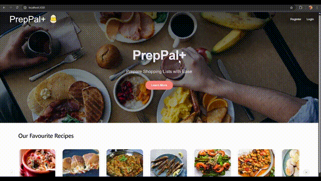
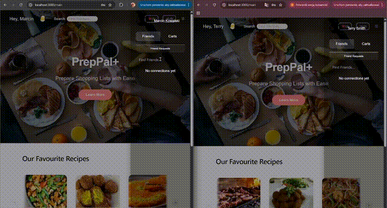
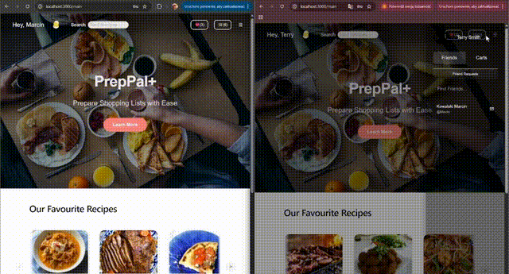

# PrepPal+

PrepPal+ is a full-stack collaborative meal planning platform built with **ASP.NET Core (Clean Architecture)** and **React**.

It supports secure authentication, real-time shared carts, social interactions, and a separate Python-based recommendation microservice. The project emphasizes maintainable architecture, domain modeling, and secure session management rather than simple CRUD functionality.

## Purpose & Learning Objectives 
This project was built to solve a practical problem: making grocery shopping easier for people who live together. 
By allowing users to collaborate on a shared shopping list in real time, the app reduces friction, miscommunication, and duplicate purchases. 

At the same time, this project serves as a hands-on learning platform to: 
- Implement real-time features using WebSockets and SignalR
- Practice backend development with ASP.NET, Entity Framework Core, JWT authentication, and refresh tokens
- Design and experiment with recommendation system algorithms
- Build a modern frontend using React and TanStack Query
- Apply Clean Architecture principles with an emphasis on code quality, maintainability, and scalability
- 
---

## Demo

### Application Overview



---

### Real-Time Connections and Messages



---

### Real-Time Cart Synchronization



---

## Features

### Authentication & Security

- ASP.NET Identity integration  
- JWT-based authentication  
- Refresh token rotation  
- SHA256-hashed refresh token storage  
- Session lifetime enforcement  
- Policy-based authorization  

### Collaborative Cart System

- Role-based cart access (Owner / Member)  
- Cart invitations and membership management  
- Permission-controlled operations  
- Optimistic UI updates using TanStack Query  

### Real-Time Communication

- SignalR hubs for cart synchronization  
- Group-based messaging  
- Instant updates across connected clients  

### Recommendation Microservice

- Built with FastAPI (Python)  
- Runs independently via Uvicorn  
- Communicates with main backend via HTTP  
- Decoupled ML experimentation and logic  

---

## Architectural Principles

- Clean Architecture  
- Repository Pattern  
- DTO mapping layer  
- Separation of domain and infrastructure concerns  
- Hub abstraction using interfaces  
- Centralized authentication and authorization policies  

---

## Technology Stack

### Backend
- ASP.NET Core  
- Entity Framework Core  
- SQL Server  
- SignalR  
- Serilog  
- JWT Authentication  
- ASP.NET Identity  

### Frontend
- React  
- TypeScript  
- TanStack Query  
- Redux Toolkit  

### Recommendation Service
- Python  
- FastAPI  
- Uvicorn  

---

## System Flow

1. The frontend authenticates using JWT access tokens.  
2. Refresh tokens are securely hashed and stored in the database.  
3. Backend enforces authorization policies for protected operations.  
4. SignalR pushes real-time updates to connected clients.  
5. The recommendation service runs independently and communicates via HTTP.  
6. Entity Framework Core manages persistence and relational mapping.  

---

## Getting Started

### Prerequisites

- Docker  
- Docker Compose  

### Clone the Repository

```bash
git clone https://github.com/vuvanqh/PrepPal.git
cd PrepPal
```

### Run the Application

```bash
docker-compose up --build
```

This will start:

- ASP.NET Core backend  
- React frontend  
- SQL Server database  
- FastAPI recommendation service  

### Access the Application

- Frontend: http://localhost:3000  
- Backend API: http://localhost:8080  
- Recommendation service: http://recommender:8000  

### Stop the Services

```bash
docker-compose down
```

---

## Project Goal

This project explores:

- Real-time distributed systems using WebSockets and SignalR  
- Secure authentication flows with token rotation  
- Clean Architecture design patterns  
- Microservice separation for ML experimentation  
- Full-stack application deployment using Docker  

It serves both as a collaborative productivity tool and as an architectural learning platform.
